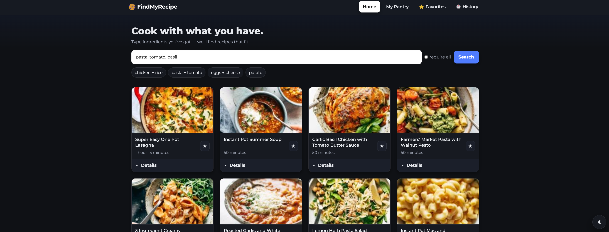

# FindMyRecipe 🍅🥗

FindMyRecipe is a lightweight web app where you simply type in the ingredients you have at home, and it instantly finds recipes that include them. No sign-up, no endless scrolling - just quick meal ideas powered by **Flask**, **Pandas**, and a **machine learning** search using TF-IDF + KNN.

Built by college students for busy students, home cooks, and anyone looking to save time, reduce food waste, and try something new.

---

## 🛑 The Problem
- People often struggle to decide *what to cook* with what’s in their kitchen.
- Throwing away unused ingredients leads to food waste and higher grocery bills.
- Many recipe apps are **overcomplicated**, require exact dish names, or force users to sign up before searching.

---

## 💡 Our Solution
- **Ingredient-based search:** Type a single ingredient, get matching recipes instantly.
- **Simple UI:** Just type → browse → cook.
- **No sign-up:** Fast, hassle-free access.
- **Food waste reduction:** Encourages use of on-hand ingredients.

---

## 📂 Project Structure

project/  
│── .github/workflows/         # GitHub Actions workflows (if used)  
│── data/  
│   └── recipes.csv            # Recipe dataset  
│── notebooks/  
│   └── model.ipynb            # Jupyter notebook for ML model  
│── src/  
│   └── app.py                 # Flask backend  
│── static/  
│   └── style.css              # Styling  
│── templates/  
│   └── index.html             # Main frontend HTML  
└── README.md                  # This file  

---

## 🚀 Features
- Search recipes by ingredient(s)  
- Option to require all entered ingredients  
- Fast similarity search powered by **scikit-learn**  
- Clean, responsive frontend with HTML + CSS

---

## 📦 Requirements

Create and activate a virtual environment, then install dependencies:  
```bash
pip install -r requirements.txt
```

Your `requirements.txt` should include:
```
Flask==3.1.1
pandas==2.2.3
numpy==2.2.4
scipy==1.15.2
scikit-learn==1.6.1
jupyterlab==4.3.4
```

## 🛠 Setup & Run

1. **Clone the repo**
   ```bash
   git clone git@github.com:Cos229-239/2025_08_Team3.git 
   cd 2025_08_Team3
   pip install -r requirements.txt
   python app.py
   ```

2. Open your browser and go to:  
   http://127.0.0.1:5000